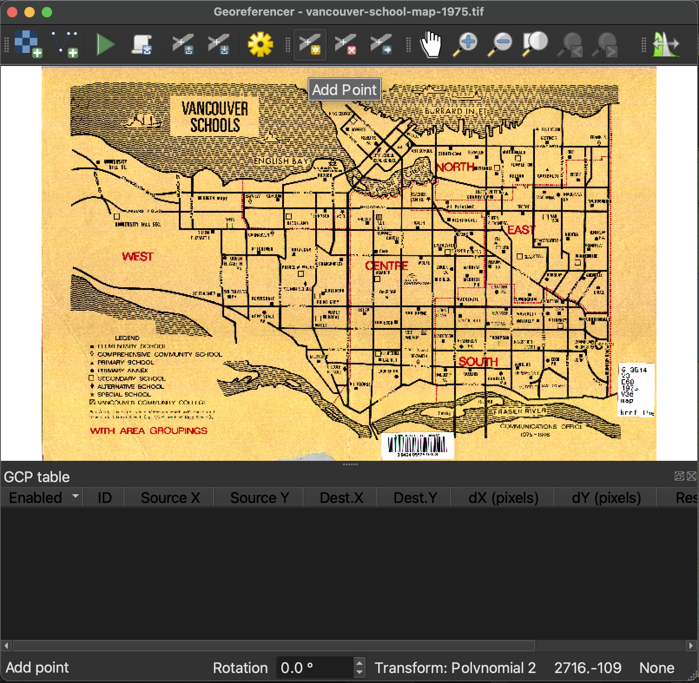
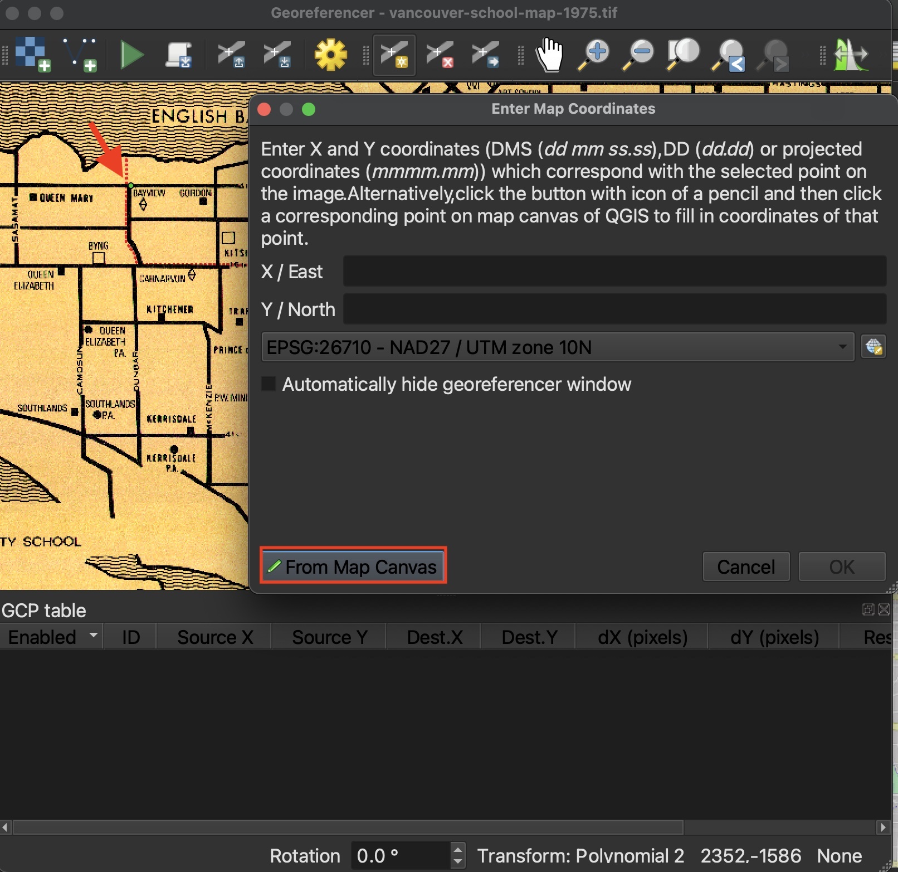
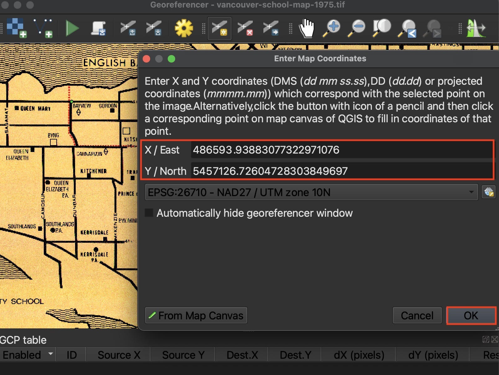
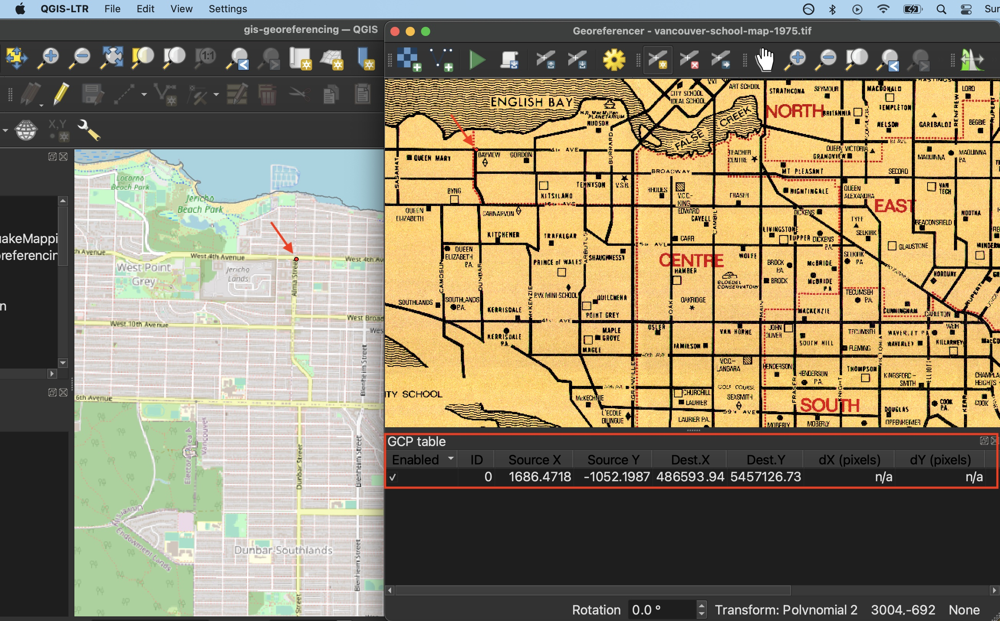
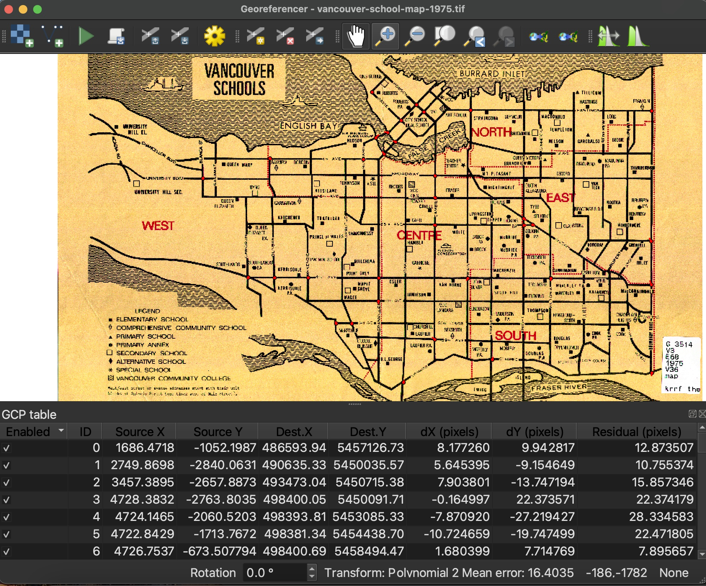
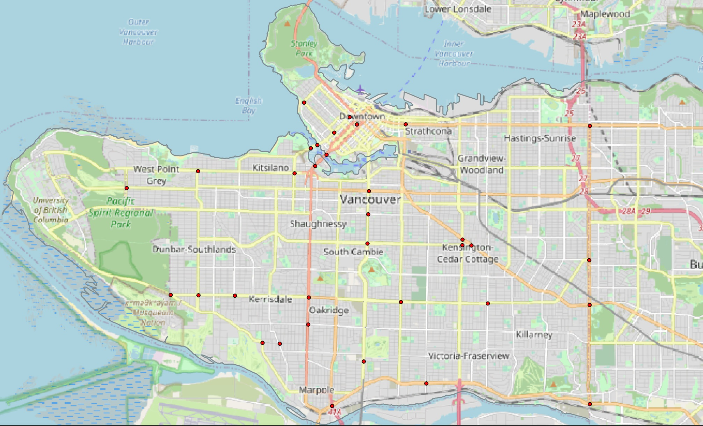
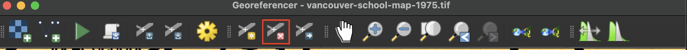

# Begin Georeferencing! 

<!-- ## Add GCP Points -->

You are now ready to begin georeferencing by adding Ground Control Points (GCPs). 
    

      
Choose your first GCP on the historical map. Once you select a GCP on Source Layer from the Georeferencer window, a dialogue box will open prompting you to Enter Map Coordinates on the Target Layer. Choose to do this from **From Map Canvas**. The QGIS Map Canvas will come to the forefront of your screen and your cursor will turn into a crosshair. Click the corresponding GCP on the Map Canvas.
    
 

   

If you need to zoom or pan on the Map Canvas, you will have to re-click "From Map Canvas" from the Enter Map Coordinates dialogue box. If the dialogue box is no longer visible, it is likely hiding behind your current window. 
{: .note}

 
Once you have have matched a GCP on the Target Layer, the Georeferencer Window will jump back to the forefront. If you are content with your selection, click OK. 

 
You should now see your first point added to the GCP table in the Georeferencer Window. 

----

Continue adding GCPs. 

Recommend - crossroads for this workshop. begin around perimeter - helps do a couple main streets. 
helps to do a couple main streets -- 41st and granville burrard boundary kingsway sm marine drive - dunbar and 
around around bridge

You can find this set of sample GCPs in the workshop folder  or download [here](). From the Georeferencer Window, you can choose to upload a set of GCPs from the menu. 
{: .note}

explain how to go back -- re do a point with error 

## Assessing Error 

dont worry about them too muc 
the more the warp the more the little red lines - showing moveing (give bridge example)

