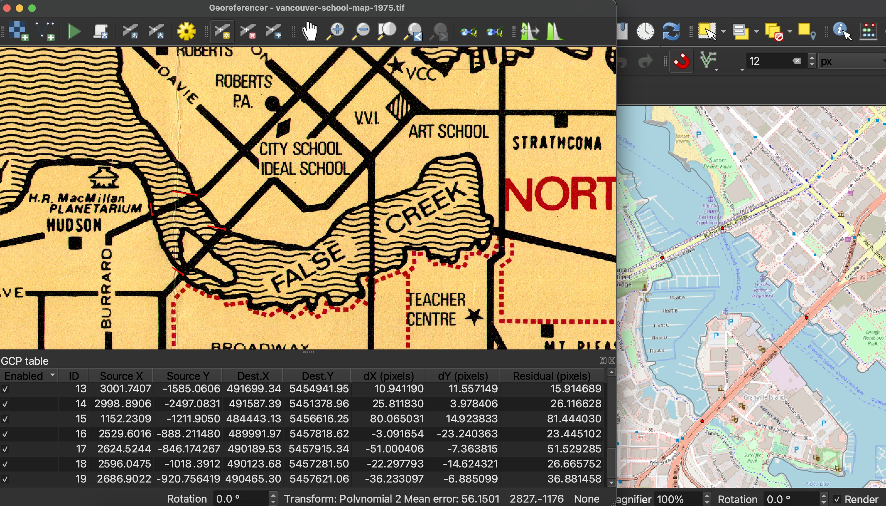

# Begin Georeferencing! 

## Add your first GCP
You are now ready to begin georeferencing by adding Ground Control Points (GCPs).  
Click the **Add Point** icon in the Georeferencer Window to get started.
    

      
Choose your first GCP on the historical map. Once you select a GCP on your Source Layer from the Georeferencer window, a dialogue box will open prompting you to Enter Map Coordinates on the Target Layer. Choose to do this from **From Map Canvas**. The QGIS Map Canvas will come to the forefront of your screen and your cursor will turn into a crosshair. Click the corresponding GCP on the OSM street map of Vancouver.
    
 

   
If you need to zoom or pan on the Map Canvas, you will have to re-click "From Map Canvas" from the Enter Map Coordinates dialogue box. If the dialogue box is no longer visible, it's likely hiding behind your current window. 
{: .warn}
 
Once you have have matched a GCP on the Target Layer, the Georeferencer Window will jump back to the forefront. If you are content with your selection, click OK. 

 
You should now see your first point added to the GCP table in the Georeferencer Window. 

    
## Continue adding GCPs
For this historical map, it's recommended you I recommend primarily using street intersections as GCPs. Begin around the periphery and then add some along major crossroads towards the center of Vancouver. I also recommend anchoring the shoreline by adding GCPs on either side of the three bridges. 

    

 
You can always remove a GCP and re-place it, or move an existing GCP around.

 
Below is a sample set of 33 GCPs. If well placed, this should be plenty to georeference this map. 

You can find this set of sample GCPs in the workshop folder  or download [here](sample-GCP-points.points). From the Georeferencer Window, you can choose to upload a set of GCPs from the menu. 
{: .note}

## Assessing Error 

In the Georeferencer Window table the column dX, dY and Residual refer to error. You may notice little red lines on your Source layer around the GCP point. These are the error vectors visualizing dX and dY. The longer the line, the greater the error. For this exercise, the error should be small and you can ignore the lines. If you get any really long ones, double check that your GCPs match. The error is likely the result of misplacing the GCP on your target layer. 
<!--note about shoreline and error, gcps around bridge etc -->
<!-- In the status bar of the Georeferencer Window you should see Mean Error. root mean square error (RMSE) vs mean error (whats given)
calculating root mean square error (RMSE) -->

