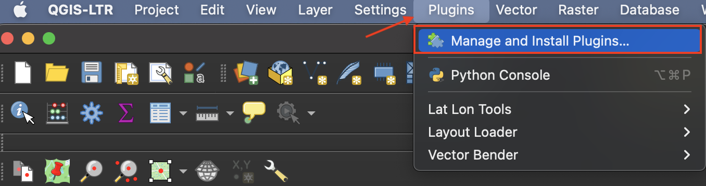
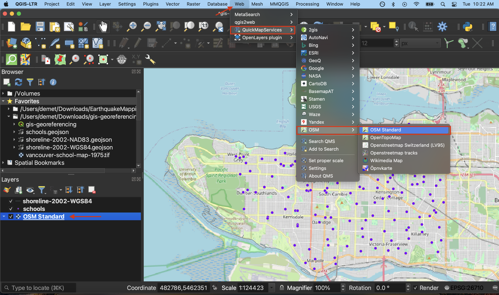

# Project Setup
If you haven't already, [download **QGIS 3.28.15 'Firenze'**](https://qgis.org/en/site/forusers/download.html). Revisit the Introduction of this workshop for instructions. You should also have downloaded **and unzipped** the [workshop project folder](gis-georeferencing-workshop.zip).
    

## Open the QGIS Project
 Unzip and open the project data folder. Inside, you will see the historical map (`vancouver-school-map-1975.tif`), `schools.geojson`, `shoreline.geojson`, and a QGIS project file called `gis-georeferencing.qgz`. Double click the QGIS project to open it. Click <a href="https://ubc-library-rc.github.io/gis-intro-qgis/content/qgis-gui.html" target="_blank">here</a> for a review of the QGIS Graphical User Interface (GUI). 

## Connect Directory 
There are many ways to connect directories (folders) and add data to a QGIS project. Adding our working folder as a “favorite” connection now will make things easier later on. In the **Browser Panel**, right click Favorites and select **Add a directory**. Navigate to your newly extracted folder called gis-georeferencing-workshop. Select it (but don’t click into it) and hit Open at the bottom right of the dialogue box. You should now see the directory `gis-georeferencing-workshop` pinned in your Browser Panel. Expand the directory to see its contents.     

From directory gis-georeferencing-workshop, drag `schools.geojson` and `shoreline.geojson` onto your map canvas to connect them to your project. You can also add them by double clicking each file from the Browser Panel. 

## Add Target Layers 
We also want as a Target Layer a map of Vancouver that has street intersections since these will make excellent GCPs. We will use a plugin to connect a web-based map of the city hosted by Open Street Maps. [QGIS plugins](https://plugins.qgis.org/) are user developed tools that extend QGIS functionality beyond the basics. To access a range of web-based maps, we'll first install the QuickMapServices plugin. Click on the **Plugin** menu at the top of your screen and select **Manage and Install Plugins...**    

   
       

In the dialogue box that opens, select **All** as a search category on the left and type "QuickMapServices" as one word. Install the plugin and close the dialogue box.    

Now go to the **Web** menu at the top of your screen. You should see the QuickMapServices plugin. Hover over it and click "Settings" at the bottom of the menu that pops up. In the settings dialogue box go to the "More services" tab and click "Get contributed pack." Click **save** to close settings and return to the **Web** menu. This time when you hover over the QuickMapServices plugin you will see an array of basemap options. Select OpenStreetMap as your basemap. Like QGIS, [Open Street Map (OSM)](https://www.openstreetmap.org/about) is open source and user developed.   

Make sure to drag your basemap to the bottom in your Layers Panel. Remove the basemap at anytime by right clicking the layer and selecting "remove". 

    

Save your QGIS project. 

You will only ever have to install a plugin once unless you delete and re-download QGIS. Installing upgrades will not erase your plugin history. However, plugins are periodically updated. If a plugin stops not working suddenly for no explicable reason, check to see if requires an update by searching for it in Plugins > Manage and Install Plugins > Installed. 
{: .note}

