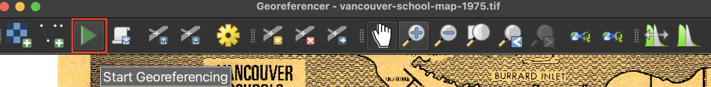

## Run Georeferencer

once you ve gotten ~30 run georeferencing to see what it looks like 

 

Adjust the transparency of the modified layer from Properties to assess how accurately it was georeferenced. 

This will help adjust symbology to make modified a bit transparent... 
(right click in layers, open properties --> transparency )

  making edits. can run georeferencing tool and then go back and continue working. 

note we didnt focus on shoreline but lined up bc projection guess was likely already projected. 

more diffiuclt with not project... can discuss in next setps. 

--

to continue georeferncing - add a few more gcps eg for ubc campus or 

georeferncer window should still be open if not do same process just open modified tif

when content. close georeferncer. 

