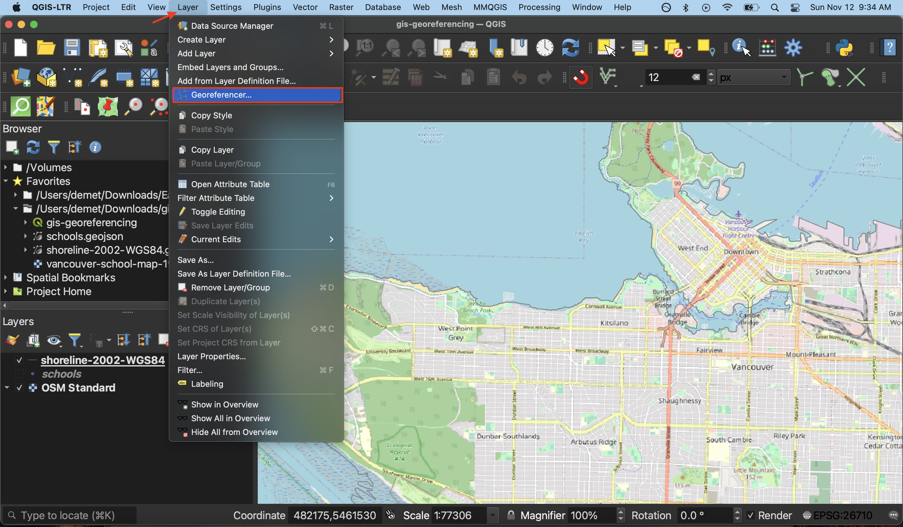
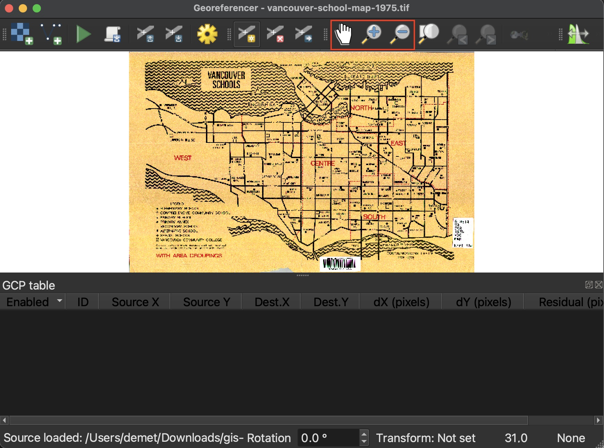

# Open Georeferencer 
Open the Georeferencer tool from the **Layers** menu at the top of your screen.  
    

The Georeferencer window has its own toolbar. Take a minute to hover over each icon to learn what they do. The Zoom and Pan buttons work the same as those on the main QGIS interface. 
    
## Load Source Layer

A raster is a file datatype where values are stored in pixel grids. Images are therefore read as raster data by by GIS. To load the historical map, double click the first tool icon called **Open Raster**. Then, navigate to the **gis-georeferencing-workshop** folder and select `vancouver-school-map-1975.tif`.  
   

You should now see the historical map loaded to the Georeferencer canvas.

Check out the QGIS <a href="https://docs.qgis.org/3.28/en/docs/user_manual/working_with_raster/georeferencer.html" target="_blank"> User Manual</a> for further documentation on the georeferencer tool. 
{: .note}