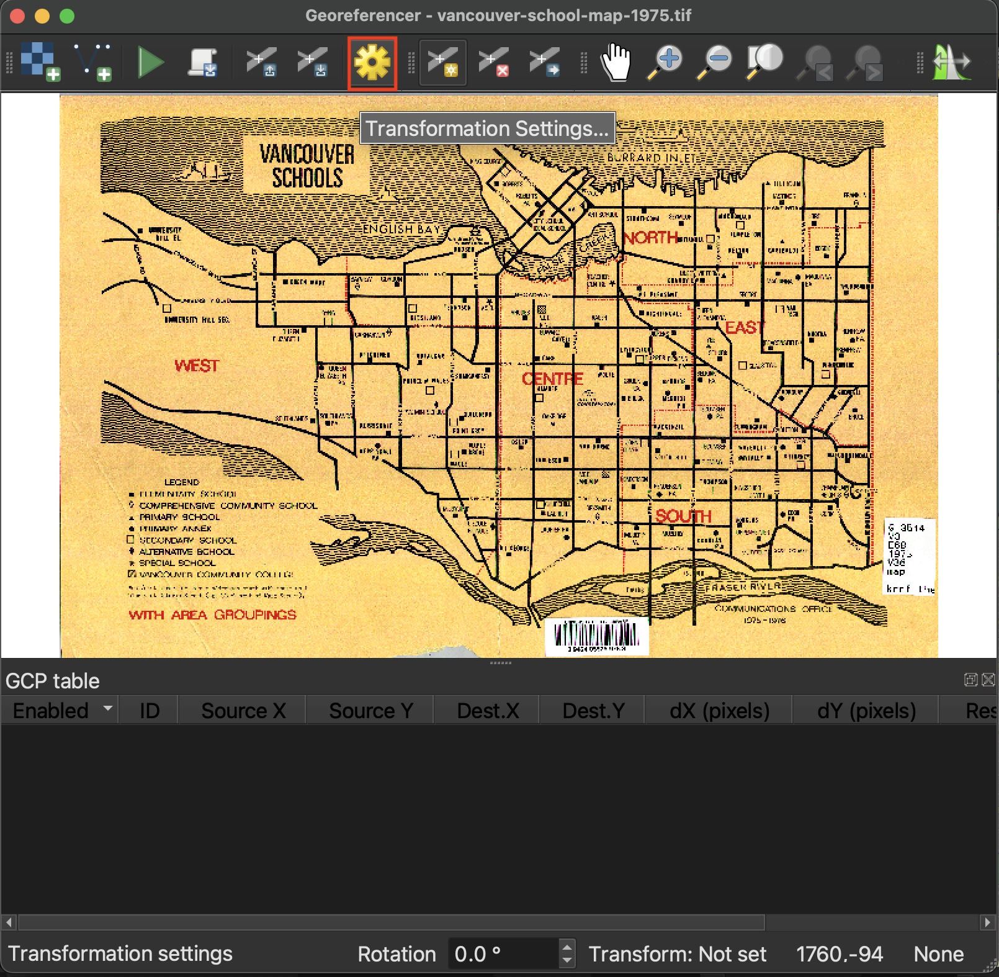
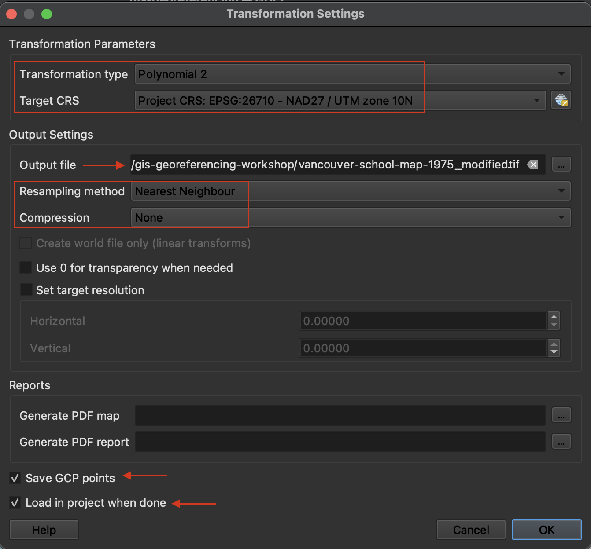

# Transformation Settings 

Transformation settings tell QGIS how to georeference -  
Cannot begin before we set these. Open transformation settings by clicking the gear icon. 
 

 

 

### Transformation Type
explain
[note on orders](https://desktop.arcgis.com/en/arcmap/latest/manage-data/raster-and-images/fundamentals-for-georeferencing-a-raster-dataset.htm)
[esri resource](https://www.esri.com/about/newsroom/wp-content/uploads/2018/07/Understanding-Raster-Georeferencing.pdf)
[qgis](https://docs.qgis.org/3.28/en/docs/user_manual/working_with_raster/georeferencer.html)

### Target CRS
This should be the project CRS (Coordinate Reference System) and the projection you wish to georeference your historical map in. 

### Output file 
QGIS should automatically save the output georeferenced image to the same folder as it currently is stored in and append "modified" to its file name. If this has not automatically occurred, save the output to the workshop folder as `vancouver-school-map-1975_modified.tif`.

### Resampling Method

### Compression

